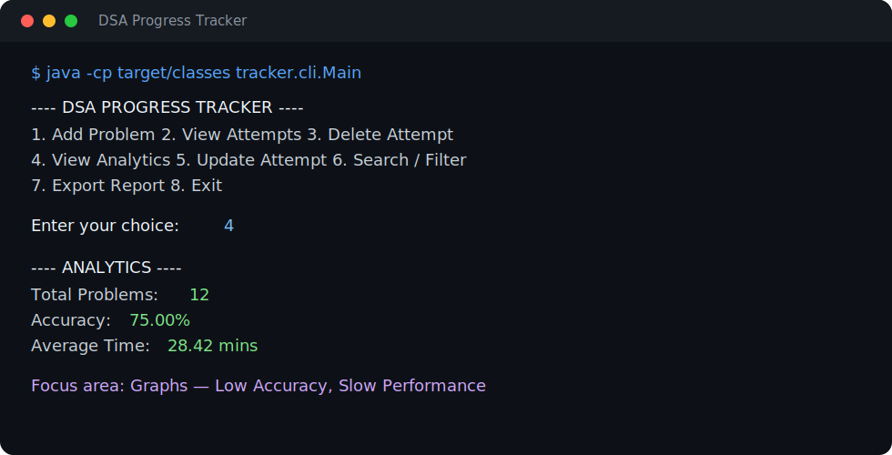

# DSA Progress Tracker

A polished Java command-line application for recording Data Structures and Algorithms practice, spotting weak areas, and building a more intentional interview-preparation routine.

Instead of only counting solved problems, the tracker turns each practice attempt into useful feedback: accuracy, speed, consistency, topic confidence, and recommended focus areas.



## Features

- Record an attempt with its title, platform, topic, difficulty, solving time, outcome, and optional notes.
- View, update, delete, search, and filter saved attempts.
- Validate interactive input clearly and safely:
  - menu selections must be valid numbers in range;
  - titles, platforms, and topics cannot be blank;
  - solving time must be a positive whole number;
  - solved status accepts `true`/`false`, `yes`/`no`, or `y`/`n`;
  - difficulty is limited to Easy, Medium, or Hard.
- Save attempts locally between sessions in `problems.txt`.
- Normalize topic names, so entries such as `array`, ` Array `, and `ARRAY` are analyzed together.
- View overall metrics: total attempts, total solved, accuracy, average time, current and longest streaks, and problems solved this week.
- Receive per-topic diagnostics for attempts, accuracy, average time, and confidence level.
- Get data-driven recommendations for under-explored, low-accuracy, and slower-than-average topics.
- Export analytics to both readable TXT and spreadsheet-friendly CSV reports.
- Run automated tests for the analytics engine with Maven and JUnit 5.

## Sample Output

```text
---- DSA PROGRESS TRACKER ----
1. Add Problem
2. View Attempts
3. Delete Attempt
4. View Analytics
5. Update Attempt
6. Search / Filter Attempts
7. Export Report
8. Exit

Enter Time Taken (in minutes): -5
Please enter a number greater than 0.

---- ANALYTICS ----
Total Problems: 12
Total Solved: 9
Accuracy: 75.00%
Average Time: 28.42 mins

---- Focus Areas (Weak Performance) ----
Topic: Graphs
- Low Accuracy (<60%)
- Slow Performance (Above overall avg)
```

## Analytics Rules

| Signal | Rule |
| --- | --- |
| Under-explored topic | Fewer than 3 attempts |
| Weak topic | At least 3 attempts and accuracy below 60% |
| Slow topic | At least 3 attempts and average time above the overall average |
| Topic confidence | Under-Explored: 0–2, Developing: 3–5, Mature: 6+ attempts |
| Current streak | Consecutive practice days ending today or yesterday |

Multiple attempts on the same day count as one practice day for streak calculations.

## Tech Stack

- Java 17
- Maven
- JUnit 5
- Java Collections and file I/O
- Object-oriented design

## How to Run

### Prerequisites

Install Java 17 or newer. Maven is recommended for compiling and running the test suite.

### With Maven

```bash
mvn test
mvn compile
java -cp target/classes tracker.cli.Main
```

### With the Java compiler

```bash
javac -d out src/tracker/models/*.java src/tracker/storage/*.java src/tracker/analytics/*.java src/tracker/reports/*.java src/tracker/cli/*.java
java -cp out tracker.cli.Main
```

The application creates or updates `problems.txt` in the directory from which it is run. Use a copy of the file if you want to experiment without changing your saved history.

## Folder Structure

```text
dsa-progress-tracker/
├── docs/
│   └── images/
│       └── sample-session.svg       # README terminal preview
├── src/
│   └── tracker/
│       ├── analytics/               # Metrics, topic reports, recommendations
│       ├── cli/                     # Interactive command-line interface
│       ├── models/                  # Attempt and difficulty domain models
│       ├── reports/                 # TXT and CSV export
│       └── storage/                 # Local persistence and repository operations
├── test/
│   └── tracker/analytics/           # JUnit analytics tests
├── pom.xml                          # Maven build and test configuration
├── problems.txt                     # Local attempt data, created at runtime
└── README.md
```

## Future Improvements

- Add a dedicated data directory and configurable storage location.
- Support CSV, JSON, or SQLite as optional storage back ends.
- Add date-range filtering and visual progress charts.
- Expand the test suite to cover persistence, repository operations, and report exports.
- Package the application as a runnable JAR.
- Add a lightweight desktop or web interface while keeping the analytics engine reusable.

## Why I Built It

DSA preparation is often tracked as a raw problem count. This project focuses on the signals behind that number—where time is going, which topics need repetition, and whether practice is consistent—so every session can inform the next one.
